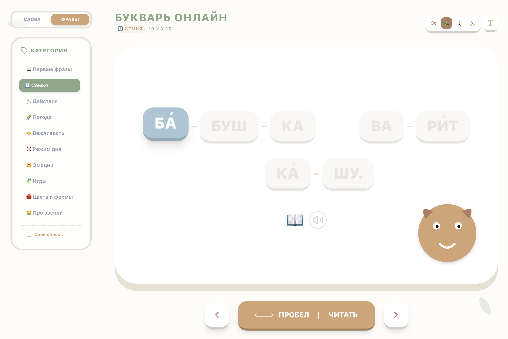

# Букварь Онлайн (Online Primer)

Интерактивное приложение для обучения детей чтению по слогам. 

## ✨ Основные функции

- **Чтение по слогам**: Слова и предложения автоматически разбиваются на слоги для удобного восприятия.
- **Озвучка (TTS)**: Используется синтез речи с эффектом «караоке» — каждый слог подсвечивается прямо во время произнесения.
- **Два режима обучения**:
  - **Слова**: Различные категории (Животные, Еда, Цвета и т.д.).
  - **Фразы**: Простые предложения для развития навыка связного чтения.
- **Поддержка ударений**: Возможность включать/выключать визуальные знаки ударения.
- **Свои списки**: Возможность загрузить свой текстовый файл со словами для тренировки.
- **Праздничная мотивация**: Веселое конфетти при успешном прочтении каждого слова.
- **Управление одной кнопкой**: Вся навигация завязана на клавишу **Пробел**, что делает использование доступным даже для самых маленьких пользователей.

## 🎨 Дизайн и интерфейс

Приложение выполнено в спокойной «природной» цветовой гамме (Sage, Ochre, Clay), которая не утомляет зрение и располагает к обучению. Интерфейс полностью адаптивен и отлично работает как на маленьких смартфонах, так и на больших мониторах.

## 🛠 Технологии

- **React + Vite**
- **Tailwind CSS** (стилизация)
- **Framer Motion** (анимации слогов)
- **canvas-confetti** (эффекты успеха)
- **Web Speech API** (синтез речи)

## 🚀 Как пользоваться

1. Выберите категорию в боковом меню (или наверху на мобильном).
2. Нажимайте **ПРОБЕЛ** или кнопку **ЧИТАТЬ**, чтобы переключаться между слогами.
3. Когда все слоги подсвечены — слово прочитано! Нажмите еще раз, чтобы перейти к следующему.
4. Нажмите иконку **Динамика**, чтобы прослушать всё слово целиком.

## 📚 Словари

Встроенные словари лежат в `public/data/words/*.txt` и `public/data/sentences/*.txt`.
Каждый файл — это одна категория, каждая непустая строка — одно слово или одно предложение.

- Для встроенных словарей держим по **25 строк на файл**, чтобы категории были ровными по объёму и прогресс в них ощущался одинаково.
- Слоги разделяются через `-`: `ко-рО-ва`.
- Ударение в исходном тексте отмечается **заглавной гласной**, а приложение уже превращает её в обычную букву с визуальным ударением.
- Для предложений формат такой же: `мА-ма мО-ет рА-му.`
- Пустые строки игнорируются.

### Как редактировать словари

1. Сохраняйте тему категории: животные к животным, транспорт к транспорту и так далее.
2. Выбирайте простые, естественные и детские слова; лучше обычное слово, чем редкая или разговорная форма.
3. Ставьте переносы по слогам во всех многосложных словах.
4. Если слово или фраза звучит странно вслух, заменяйте её на более привычный вариант.
5. После изменений откройте нужную категорию в приложении и проверьте подсветку слогов и озвучку.

Свой `.txt`-файл тоже можно загрузить через интерфейс. Для него действует тот же формат: одна строка на элемент, слоги через `-`, ударение через заглавную гласную.
